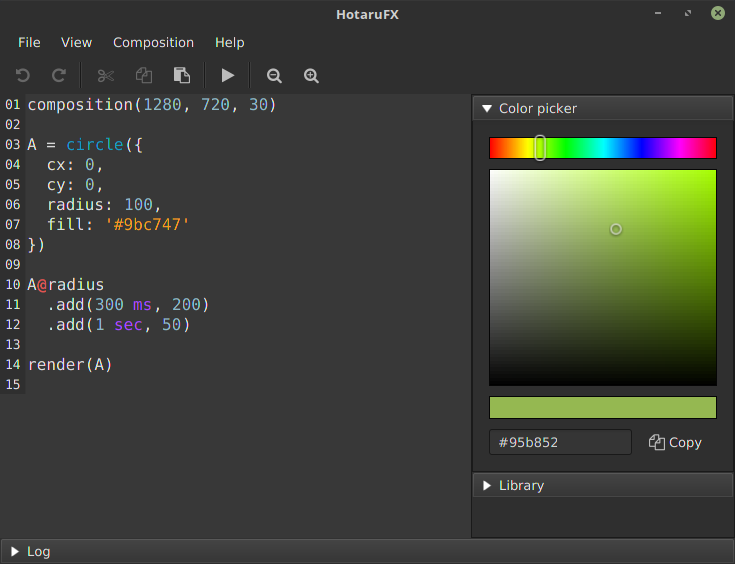

HotaruFX
========

Programming language for creating animations




## Demo


```java
composition(320, 57, 25, "#2F2F2F")

LOGO = text({
  x: -2135,
  y: 0,
  valign: "CENTER",
  text: 'HotaruFX',
  fill: '#FDFD42',
  font: 800,
  css: '
    -fx-font-weight: bold;
    -fx-effect: dropshadow(three-pass-box, rgba(100,183,3,0.8), 68, 0, 0.5, 0.25);
  '
})

LOGO@fill
  .add(2 sec, "#82fd42", easeOut)
  .add(4 sec, "#FDFD42", ease)

render(LOGO)
```


```java
composition(1280, 720, 50)

LOVE = text({
  x: -80
  y: 0
  valign: "CENTER"
  text: "\uf004"
  fill: '#cf1010'
  font: 200
  opacity: 0
})
LOVE.scaleX = LOVE.scaleY = 0
LOVE@scaleX
  .add(100 ms, 1.0, easeIn)
  .add(400 ms, 1.4, easeOut)
  .add(800 ms, 1.1, easeOut)
LOVE@scaleY
  .add(100 ms, 1.0, easeIn)
  .add(400 ms, 1.4, easeOut)
  .add(800 ms, 1.1, easeOut)
LOVE@opacity
   .add(350 ms, 1, easeIn)
   .add(600 ms, 1, hold)
   .add(800 ms, 0, easeOut)

GITHUB = text({
  x: -45
  y: 0
  valign: "CENTER"
  text: "\uf09b"
  fill: 'white'
  font: 150
})
GITHUB@fill
   .add(600 ms, 'white', hold)
   .add(800 ms, '#cf1010', easeOut)
GITHUB@opacity
   .add(1.2 sec, 1, hold)
   .add(1.5 sec, 0, easeOut)

render(LOVE GITHUB)
```


```java
composition(1280, 720, 30)

CLIP = circle({
  cx: 400,
  cy: 0,
  radius: 80
})

TEXT = text({
  x: -220,
  y: 0,
  text: "HotaruFX",
  fill: "white",
  stroke: "black",
  font: 100,
  valign: "CENTER",
  underline: true,
  clip: CLIP,
  css: '
    -fx-effect: dropshadow(two-pass-box, rgba(0,0,0,0.8), 5, 0, 0.5, 0.25);
  '
})

CLIP@cx
  .add(1.2 sec, -210, easeOut)
  .add(3 sec, 0, ease)
CLIP@radius
  .add(1.2 sec, 80, discrete)
  .add(3 sec, 300, ease)
TEXT@fill
  .add(3 sec, 'white', hold)
  .add(4 sec, '#D6EA2A', easeOut)

render(CLIP, TEXT)
```

See other examples in [examples folder](app/src/main/resources/examples) or in `File -> Open Example` menu.


## Build

```
./gradlew  shadowJar
```

Build requires JDK-8u60 or higher and Java FX support. Assembled binaries are stored in `app/build/libs` directory.


## Run

```
./gradlew run
```

Application requires JRE-8u60 or higher and Java FX support. Works properly on Oracle JDK 8 and OpenJDK 8 + openjfx.

## License

Apache 2.0. See [license information](LICENSE).


